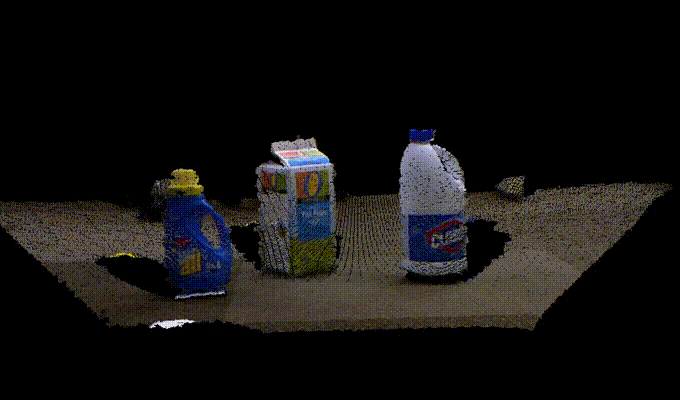

# PCL

A Julia interface for Point Cloud Library (PCL)



Note that PCL.jl was started as an experimental project and not full-featured.


## Dependencies

- [Cxx.jl](https://github.com/Keno/Cxx.jl)
- [pcl](https://github.com/PointCloudLibrary/pcl) (master)

## Installation

You fist need to install [Cxx.jl](https://github.com/Keno/Cxx.jl). And then, you can install PCL.jl by:

```jl
Pkg.clone("https://github.com/r9y9/PCL.jl.git")
Pkg.build("PCL")
```

This should install PCL.jl and resolve its binary dependency property. Note that building PCL library (C++) is relatively complex (needs boost, flann, vtk, etc.), so you are recommended to check if PCL is able to build successfully first, and then build PCL.jl.

By default, `Pkg.build("PCL")` will try to find system-installed PCL libraries. If you have already PCL libraries installed, you don't have to re-build PCL for PCL.jl, however, this might cause incompatibility to PCL.jl depends on your PCL version. If you have any problem with system-installed ones, please try to ignore them and rebuild PCL.jl by:

```jl
julia> ENV["PCLJL_LIBRARY_IGNORE_PATH"] = "/usr/lib:/usr/local/lib" # depends on your environment
julia> Pkg.build("PCL")
```

The PCL library paths will be stored in `PCL.pcl.libpcl_xxx` after loading PCL.jl. The library path should look like for example:

```jl
julia> using PCL
julia> PCL.pcl.libpcl_common
"$your_home_dir_path/.julia/v0.5/PCL/deps/usr/lib/libpcl_common.dylib"
```
