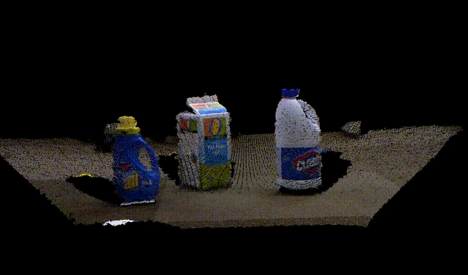
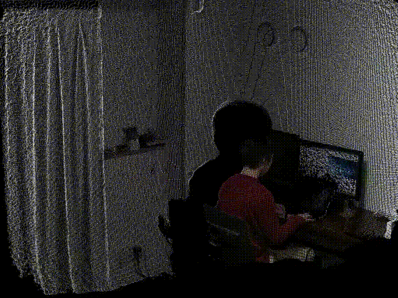
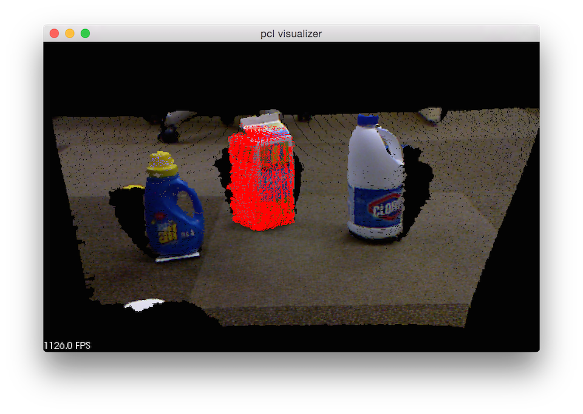
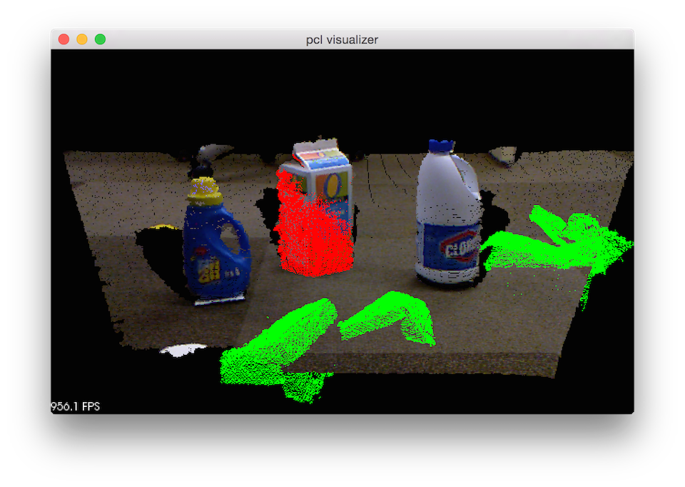
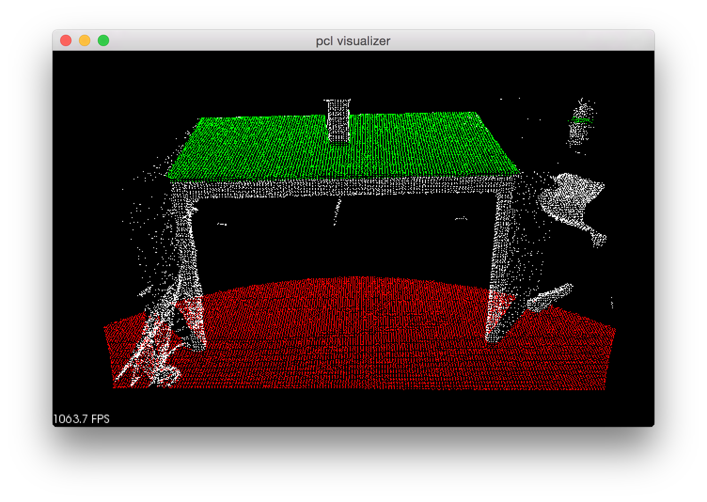
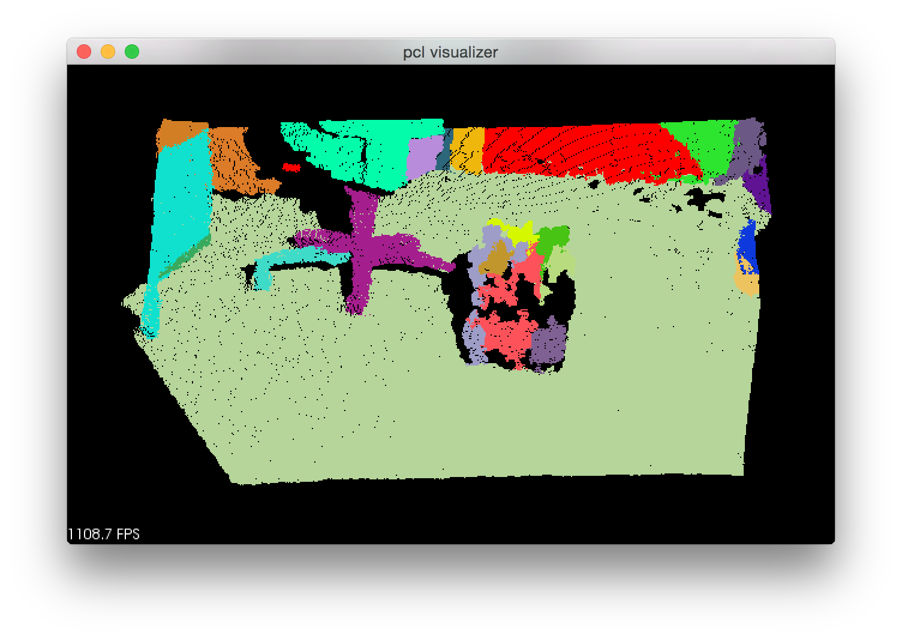

# PCL

A Julia interface for [Point Cloud Library (PCL)](http://www.pointclouds.org/)

Note that PCL.jl was started as an experimental project and is very much work in progress. Currently only tested on osx 10.10.4.

## Dependencies

- [Julia](https://github.com/JuliaLang/julia) (master)
- [Cxx.jl](https://github.com/Keno/Cxx.jl) (master)
- [pcl](https://github.com/PointCloudLibrary/pcl) (master)

## Installation

You fist need to install [Cxx.jl](https://github.com/Keno/Cxx.jl). And then, you can install PCL.jl by:

```jl
Pkg.clone("https://github.com/r9y9/PCL.jl.git")
Pkg.build("PCL")
```

This should install PCL.jl and resolve its binary dependency property. Note that building PCL library (C++) is relatively complex (needs boost, flann, vtk, etc.), so you are recommended to check if PCL is able to build successfully first, and then build PCL.jl.

By default, `Pkg.build("PCL")` will try to find system-installed PCL libraries. If you have already PCL libraries installed, you don't have to re-build PCL for PCL.jl, however, this might cause incompatibility to PCL.jl depends on your PCL version. If you have any problem with system-installed ones, please try to ignore them and rebuild PCL.jl by:

```jl
julia> ENV["PCLJL_LIBRARY_IGNORE_PATH"] = "/usr/lib:/usr/local/lib" # depends on your environment
julia> Pkg.build("PCL")
```

The PCL library paths will be stored in `PCL.pcl.libpcl_xxx` after loading PCL.jl. The library path should look like for example:

```jl
julia> using PCL
julia> PCL.pcl.libpcl_common
"$your_home_dir_path/.julia/v0.5/PCL/deps/usr/lib/libpcl_common.dylib"
```

### Notes for osx

```
brew install cmake openni openni2 qhull boost glew flann eigen libusb vtk
```

may help to build PCL.

## Documentation

Please check the http://www.pointclouds.org/documentation/.

## API

- Function names should be exactly same between Julia and C++.
- C++ template classes are available in Julia as templated types
- Single namespace `pcl` in Julia (**inconsistent between Julia and C++. Might change**)
- C++ dereferences which sometimes needed in C++, are hidden in implementation in Julia

e.g.

In C++:

```cpp
pcl::PassThrough<pcl::PointXYZ> pass;
pass.setInputCloud (cloud);
pass.setFilterFieldName ("z");
pass.setFilterLimits (0.0, 1.0);
pass.filter (*cloud_filtered);
```

In Julia:

```jl
pass = pcl.PassThrough{pcl.PointXYZ}()
pcl.setInputCloud(pass, cloud)
pcl.setFilterFieldName(pass, "z")
pcl.setFilterLimits(pass, 0.0, 1.0)
pcl.filter(pass, cloud_filtered)
```

## How it works

### PCLVisualizer [[code]](examples/pcl_visualizer.jl)

<div align="center"></div>

### Real-time Kinect v2 grabber [[code]](examples/libfreenect2_grabbar.jl)

<div align="center"></div>

Requires [Libfreenect2.jl](https://github.com/r9y9/Libfreenect2.jl) and Kinect v2.

### 3D Object Recognition based on Correspondence Grouping [[code]](examples/correspondence_grouping.jl)

<div align="center"></div>

### Hypothesis Verification for 3D Object Recognition [[code]](examples/global_hypothesis_verification.jl)

<div align="center"></div>

### Extracting indices from a PointCloud [[code]](examples/extract_indices.jl)

<div align="center"></div>

### Color-based region growing segmentation [[code]](examples/region_growing_rgb_segmentation.jl)

<div align="center"></div>

You can find more examples in [examples directory](examples/).

## Something missing?

You have two solutions:

1. Write C++ using Cxx.jl. No glue code is required, but cannot get full benefit of Julia.
2. Write Julia glue code (e.g. Julia type for C++ class, with appropriate generic functions), need certain work to maintain though.

Currently PCL.jl takes the second approach. I'm still thinking what is the best way to make PCL.jl more usable.
